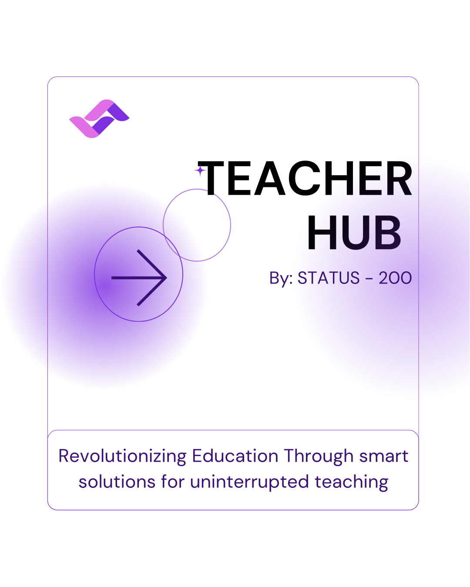

# Teacher Hub - Docker Setup Guide

<div align="center">
  
  <h3>Complete Docker Deployment Guide</h3>
  <p>One-click setup for development and production environments</p>
</div>

## 📋 Table of Contents

- [Quick Start](#quick-start)
- [Prerequisites](#prerequisites)
- [Architecture Overview](#architecture-overview)
- [Installation](#installation)
- [Configuration](#configuration)
- [Usage](#usage)
- [Production Deployment](#production-deployment)
- [Troubleshooting](#troubleshooting)
- [Development](#development)
- [Maintenance](#maintenance)

## 🚀 Quick Start

For the fastest setup, run our one-click installation script:

```bash
# Clone the repository
git clone https://github.com/your-org/teacher-hub.git
cd teacher-hub

# Run the setup script
./setup.sh
```

That's it! The script will:
- Check system requirements
- Set up environment variables
- Build and start all services
- Set up the database
- Create sample data

Access the application at:
- **Frontend**: http://localhost:3000
- **Backend API**: http://localhost:8000
- **Admin Panel**: http://localhost:8000/admin

## 📦 Prerequisites

### System Requirements
- **Docker**: Version 20.10 or higher
- **Docker Compose**: Version 2.0 or higher
- **Operating System**: Linux, macOS, or Windows with WSL2
- **RAM**: Minimum 4GB, Recommended 8GB
- **Storage**: Minimum 2GB free space

### Installation Links
- [Docker Desktop](https://docs.docker.com/get-docker/)
- [Docker Compose](https://docs.docker.com/compose/install/)

### Verify Installation
```bash
docker --version
docker-compose --version
docker info
```

## 🏗️ Architecture Overview

The Teacher Hub application consists of the following services:

```
┌─────────────────┐    ┌─────────────────┐    ┌─────────────────┐
│   Frontend      │    │    Backend      │    │   Database      │
│   (Next.js)     │◄──►│   (Django)      │◄──►│  (PostgreSQL)   │
│   Port: 3000    │    │   Port: 8000    │    │   Port: 5432    │
└─────────────────┘    └─────────────────┘    └─────────────────┘
         │                       │                       │
         │              ┌─────────────────┐              │
         │              │     Redis       │              │
         └──────────────►│  (Cache/Queue)  │◄─────────────┘
                        │   Port: 6379    │
                        └─────────────────┘
                                 │
                        ┌─────────────────┐
                        │  Celery Worker  │
                        │ (Background     │
                        │    Tasks)       │
                        └─────────────────┘
```

### Services Description

| Service | Description | Port | Health Check |
|---------|-------------|------|--------------|
| **Frontend** | Next.js React application | 3000 | HTTP GET /api/health |
| **Backend** | Django REST API with WebSocket support | 8000 | HTTP GET /admin/ |
| **Database** | PostgreSQL database | 5432 | pg_isready |
| **Redis** | Cache and message broker | 6379 | redis-cli ping |
| **Celery** | Background task worker | - | Process monitoring |
| **Celery Beat** | Scheduled task scheduler | - | Process monitoring |
| **Nginx** | Reverse proxy (production) | 80/443 | HTTP GET /health |

## 💻 Installation

### Method 1: One-Click Setup (Recommended)

```bash
# Make the script executable
chmod +x setup.sh

# Run the setup script
./setup.sh
```

### Method 2: Manual Setup

1. **Clone the repository**
   ```bash
   git clone https://github.com/your-org/teacher-hub.git
   cd teacher-hub
   ```

2. **Set up environment variables**
   ```bash
   cp env.example .env
   # Edit .env with your configuration
   ```

3. **Build and start services**
   ```bash
   docker-compose build
   docker-compose up -d
   ```

4. **Set up database**
   ```bash
   # Wait for services to start
   sleep 30
   
   # Run migrations
   docker-compose exec backend python manage.py migrate
   
   # Create sample data
   docker-compose exec backend python manage.py create_sample_data
   
   # Create superuser (optional)
   docker-compose exec backend python manage.py createsuperuser
   ```

## ⚙️ Configuration

### Environment Variables

The application uses environment variables for configuration. Key variables include:

#### Django Configuration
```env
SECRET_KEY=your-secret-key-here
DEBUG=True
DJANGO_SETTINGS_MODULE=backend.settings
```

#### Database Configuration
```env
DB_NAME=teacher_hub
DB_USER=postgres
DB_PASSWORD=postgres123
DB_HOST=db
DB_PORT=5432
```

#### Email Configuration (Required for notifications)
```env
EMAIL_BACKEND=django.core.mail.backends.smtp.EmailBackend
EMAIL_HOST=smtp.gmail.com
EMAIL_PORT=587
EMAIL_HOST_USER=your-email@gmail.com
EMAIL_HOST_PASSWORD=your-app-password
EMAIL_USE_TLS=True
```

#### JioMeet Integration (Optional)
```env
SECRET_KEY_JIO=your-jio-meet-secret-key
APP_ID_JIO=your-jio-meet-app-id
```

### Email Setup Guide

1. **Enable 2-Factor Authentication** on your Gmail account
2. **Generate App Password**:
   - Go to Google Account settings
   - Security → 2-Step Verification → App passwords
   - Generate password for "Mail"
3. **Update .env file** with your email and app password

### JioMeet Setup (Optional)

1. Register at [JioMeet Developer Portal](https://jiomeetpro.jio.com/)
2. Create an application
3. Get your App ID and Secret Key
4. Update the .env file

## 🎯 Usage

### Starting the Application

```bash
# Start all services
docker-compose up -d

# View logs
docker-compose logs -f

# Check service status
docker-compose ps
```

### Stopping the Application

```bash
# Stop all services
docker-compose down

# Stop and remove volumes (WARNING: This will delete all data)
docker-compose down -v
```

### Accessing Services

| Service | URL | Description |
|---------|-----|-------------|
| Frontend | http://localhost:3000 | Main application interface |
| Backend API | http://localhost:8000 | REST API endpoints |
| Admin Panel | http://localhost:8000/admin | Django admin interface |
| API Documentation | http://localhost:8000/api/v1 | Swagger API documentation |

### Default Accounts

After running `create_sample_data`, you can use these test accounts:

#### School Admin
- **Email**: admin@delhipublic.edu
- **Password**: admin123

#### Internal Teacher
- **Email**: teacher@delhipublic.edu
- **Password**: teacher123

#### External Teacher
- **Email**: substitute@example.com
- **Password**: substitute123

## 🌐 Production Deployment

### Using Nginx (Recommended)

1. **Enable Nginx service**
   ```bash
   docker-compose --profile production up -d
   ```

2. **Configure SSL (Optional)**
   ```bash
   # Create SSL directory
   mkdir -p ssl
   
   # Add your SSL certificates
   cp your-cert.pem ssl/cert.pem
   cp your-key.pem ssl/key.pem
   
   # Update nginx.conf to enable SSL
   ```

3. **Update environment variables**
   ```env
   DEBUG=False
   ALLOWED_HOSTS=your-domain.com
   CORS_ALLOWED_ORIGINS=https://your-domain.com
   FRONTEND_URL=https://your-domain.com
   ```

### Environment-Specific Configurations

#### Development
```bash
docker-compose up -d
```

#### Production
```bash
docker-compose --profile production up -d
```

#### Scaling Services
```bash
# Scale celery workers
docker-compose up -d --scale celery=3

# Scale backend instances
docker-compose up -d --scale backend=2
```

## 🔧 Troubleshooting

### Common Issues

#### Port Already in Use
```bash
# Check what's using the port
lsof -i :3000
lsof -i :8000

# Kill the process or change ports in docker-compose.yml
```

#### Database Connection Issues
```bash
# Check database logs
docker-compose logs db

# Restart database
docker-compose restart db

# Reset database (WARNING: Deletes all data)
docker-compose down -v
docker-compose up -d
```

#### Email Not Working
1. Check Gmail App Password is correct
2. Verify 2FA is enabled
3. Check email logs:
   ```bash
   docker-compose logs backend | grep -i email
   ```

#### WebSocket Connection Issues
```bash
# Check Redis is running
docker-compose logs redis

# Restart Redis
docker-compose restart redis
```

### Debugging Commands

```bash
# View all logs
docker-compose logs -f

# View specific service logs
docker-compose logs -f backend
docker-compose logs -f frontend

# Execute commands in containers
docker-compose exec backend python manage.py shell
docker-compose exec backend python manage.py migrate

# Check container status
docker-compose ps
docker stats
```

### Performance Monitoring

```bash
# Monitor resource usage
docker stats

# Check disk usage
docker system df

# Clean up unused resources
docker system prune -f
```

## 🛠️ Development

### Development Setup

1. **Start development environment**
   ```bash
   docker-compose up -d
   ```

2. **Enable hot reload** (Backend)
   ```bash
   # The backend already has --reload enabled in docker-compose.yml
   # Changes to Python files will automatically restart the server
   ```

3. **Frontend development**
   ```bash
   # For frontend development with hot reload
   cd frontend
   npm run dev
   ```

### Making Changes

#### Backend Changes
- Changes to Python files trigger automatic reload
- For new dependencies: rebuild the container
  ```bash
  docker-compose build backend
  docker-compose up -d backend
  ```

#### Frontend Changes
- Changes are automatically reflected (hot reload enabled)
- For new dependencies: rebuild the container
  ```bash
  docker-compose build frontend
  docker-compose up -d frontend
  ```

#### Database Changes
```bash
# Create new migration
docker-compose exec backend python manage.py makemigrations

# Apply migrations
docker-compose exec backend python manage.py migrate
```

### Testing

```bash
# Run backend tests
docker-compose exec backend python manage.py test

# Run frontend tests
docker-compose exec frontend npm test

# Run linting
docker-compose exec backend python -m flake8
docker-compose exec frontend npm run lint
```

## 🔄 Maintenance

### Regular Maintenance Tasks

#### Database Backup
```bash
# Backup database
docker-compose exec db pg_dump -U postgres teacher_hub > backup.sql

# Restore database
docker-compose exec -T db psql -U postgres teacher_hub < backup.sql
```

#### Log Management
```bash
# View log sizes
docker-compose logs --no-color | wc -l

# Clean logs
docker-compose down
docker-compose up -d
```

#### Update Application
```bash
# Pull latest changes
git pull origin main

# Rebuild and restart
docker-compose build
docker-compose up -d

# Run migrations
docker-compose exec backend python manage.py migrate
```

#### Security Updates
```bash
# Update base images
docker-compose build --no-cache

# Update dependencies
docker-compose exec backend pip install --upgrade -r requirements.txt
docker-compose exec frontend npm update
```

### Monitoring

#### Health Checks
```bash
# Check all services
docker-compose ps

# Test endpoints
curl http://localhost:3000/api/health
curl http://localhost:8000/admin/
```

#### Performance Metrics
```bash
# Container resource usage
docker stats

# Database performance
docker-compose exec db psql -U postgres -c "SELECT * FROM pg_stat_activity;"
```

## 📚 Additional Resources

### Documentation
- [Django Documentation](https://docs.djangoproject.com/)
- [Next.js Documentation](https://nextjs.org/docs)
- [Docker Documentation](https://docs.docker.com/)
- [PostgreSQL Documentation](https://www.postgresql.org/docs/)

### Support
- **Issues**: [GitHub Issues](https://github.com/your-org/teacher-hub/issues)
- **Discussions**: [GitHub Discussions](https://github.com/your-org/teacher-hub/discussions)
- **Email**: support@teacherhub.com

### Contributing
1. Fork the repository
2. Create a feature branch
3. Make your changes
4. Test thoroughly
5. Submit a pull request

---

## 🎉 Conclusion

This Docker setup provides a complete, production-ready deployment of the Teacher Hub application. The one-click setup script makes it easy to get started, while the comprehensive configuration options allow for customization based on your needs.

For any issues or questions, please refer to the troubleshooting section or contact our support team.

**Happy Teaching! 🎓** 