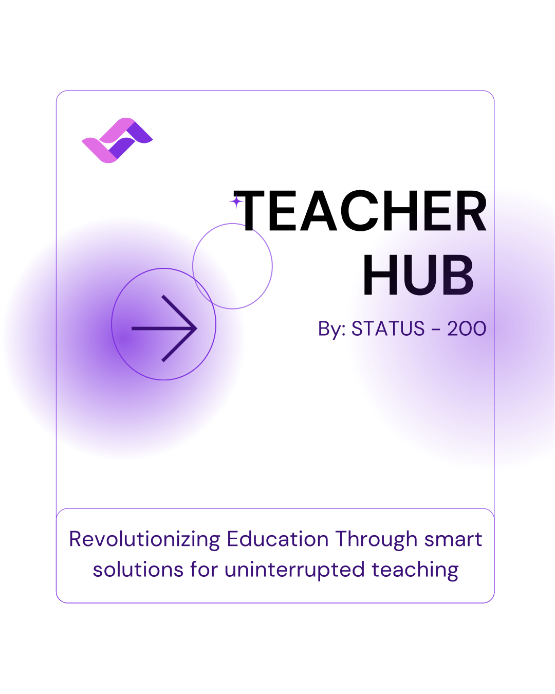

# Teacher Hub - Substitute Teacher Management System

<div align="center">
  
  <h3>A comprehensive platform connecting schools with qualified substitute teachers</h3>
  <h4>Created by team STATUS-200</h4>
</div>

## 👥 Team Members

- Pratik Rana
- Manan Chawla
- Krishna Sharma
- Sudershan Singh Negi
- Rahul Kumar

## 📋 Overview

Teacher Hub is a comprehensive platform designed to streamline the process of managing substitute teacher requests and assignments in educational institutions. The platform bridges the gap between schools needing qualified substitutes and teachers looking for opportunities, making the entire process efficient and transparent.

Our solution addresses critical pain points in the education sector:

- Schools struggle to find qualified substitutes on short notice
- Substitute teachers have difficulty finding consistent opportunities
- Manual assignment processes are time-consuming and error-prone
- Lack of centralized systems leads to communication breakdowns

## ✨ Features

### 👤 User Management

- **Multi-role System**: Support for School Administrators, Principals, Internal Teachers, External Teachers, and Students
- **Secure Authentication**: JWT-based authentication with role-based access control
- **Profile Management**: Comprehensive profiles with credentials, subjects, availability, and preferences
- **Dashboard**: Personalized dashboards for each user role

### 📝 Substitute Request Management

- **Create Requests**: School staff can quickly create detailed substitute requests
- **Smart Matching**: Algorithm-based matching of substitutes based on subject, availability, and qualifications
- **Invitation System**: Batch processing of invitations to potential substitute teachers
- **Priority Settings**: Set urgency levels for time-sensitive requests
- **Status Tracking**: End-to-end request lifecycle tracking (Pending → Awaiting Acceptance → Assigned → Completed/Cancelled)

### 📅 Availability Management

- **Detailed Scheduling**: Teachers can set their availability by date, time slots, and recurring patterns
- **Status Options**: Mark availability as Available, Busy, or Tentative
- **Conflict Detection**: Automatic conflict detection when scheduling overlaps
- **Subject Preferences**: Specify preferred subjects for specific time slots

### 📊 Teaching Session Management

- **Session Tracking**: Complete lifecycle management of teaching sessions
- **Online Integration**: JioMeet integration for virtual classroom sessions
- **Recording Management**: Store and manage session recordings
- **Attendance Tracking**: Monitor student attendance for each session
- **Session Reports**: Generate comprehensive session reports with teacher remarks

### 🏫 School Management

- **Multi-school Support**: Platform supports multiple schools with different configurations
- **Staff Management**: Track roles and departments within schools
- **School Profiles**: Comprehensive school information including board type and category
- **Algorithm Customization**: Schools can customize the teacher matching algorithm parameters

## 🏁 Getting Started

### Prerequisites

- Python 3.10+
- Node.js 16+
- PostgreSQL 13+
- Redis (for message queuing)

### Backend Setup

1. Clone the repository:

   ```bash
   git clone https://github.com/STATUS-200/teacher-hub.git
   cd teacher-hub
   ```
2. Create and activate a Python virtual environment:

   ```bash
   python -m venv venv
   source venv/bin/activate  # On Windows: venv\Scripts\activate
   ```
3. Install backend dependencies:

   ```bash
   cd backend
   pip install -r requirements.txt
   ```
4. Configure environment variables:

   ```bash
   # Create a .env file in the backend directory with these variables

   # Django secret key (generate a secure key for production)
   SECRET_KEY='django-insecure-+n5l=v8s1r+6$s&+0ag*cw$1(u0zm)l^j%hrm6u)=3yh8c1h04'
   DJANGO_SETTINGS_MODULE='backend.settings'

   # Debug mode (set to False in production)
   DEBUG='True'

   # Database configuration
   DB_NAME='teacher_hub'
   DB_USER='postgres'
   DB_PASSWORD='password'
   DB_HOST='localhost'
   DB_PORT='5432'

   # Email configuration (required for notifications)
   EMAIL_BACKEND='django.core.mail.backends.smtp.EmailBackend'
   EMAIL_HOST='smtp.gmail.com'
   EMAIL_PORT='587'
   EMAIL_HOST_USER='your-email@gmail.com'
   EMAIL_HOST_PASSWORD='your-app-password'
   EMAIL_USE_TLS=True

   # Video conferencing integration
   SECRET_KEY_JIO='your-jio-meet-secret-key'
   APP_ID_JIO='your-jio-meet-app-id'
   ```
5. Set up the database and create initial data:

   ```bash
   python manage.py migrate
   python manage.py createsuperuser
   python manage.py create_sample_data
   python manage.py fix_internal_teachers
   ```
6. Start the backend server:

   ```bash
   uvicorn backend.asgi:application
   ```

### Frontend Setup

1. Install frontend dependencies:

   ```bash
   cd ../frontend
   npm install --legacy-peer-deps
   ```
2. Configure environment variables:

   ```bash
   # Create a .env.local file in the frontend directory:
   NEXT_PUBLIC_API_URL=http://localhost:8000/api
   NEXT_PUBLIC_SOCKET_URL=ws://localhost:8000/ws
   ```
3. Start the frontend development server:

   ```bash
   npm run dev
   ```
4. Access the application at http://localhost:3000

## 🔄 System Workflows

### School Administrator/Principal Workflow

1. **School Registration and Setup**

   - Create a school profile with details like school name, category, board type, and location
   - Configure matching algorithm settings for substitute assignment
   - Add internal teachers and staff members to the system
2. **Managing Substitute Requests**

   - Review substitute requests created by teachers
   - Monitor the status of all substitute requests
   - Override automatic assignments when necessary
   - View comprehensive reports on substitute utilization
3. **Staff Management**

   - Add internal teachers with appropriate role assignments
   - Monitor teacher availability and teaching sessions
   - Handle verification of teacher profiles and documents
   - Set subscription status and access level for the school

### Internal Teacher Workflow

1. **Profile and Availability Management**

   - Complete profile with qualifications, subjects, and teaching methodology
   - Set availability using the calendar with recurring patterns
   - Mark specific time slots as Available, Busy, or Tentative
   - Specify preferred subjects for each time slot
2. **Substitute Request Creation**

   - Create substitute requests when planning to be absent
   - Specify subject, grade, section, and time details
   - Set mode of teaching (Online, Offline, or Hybrid)
   - Add special instructions for the substitute teacher
   - Prioritize requests (Low, Medium, High, Urgent)
3. **Class Handover and Review**

   - Provide lesson plans and materials for the substitute
   - Review session reports after completion
   - Track attendance and participation in substituted classes

### External Teacher (Substitute) Workflow

1. **Profile and Availability Setup**

   - Create a comprehensive profile with qualifications and teaching experience
   - Upload credentials for verification
   - Set hourly rates and travel preferences
   - Manage detailed weekly availability with preferred subjects
2. **Finding and Accepting Opportunities**

   - Receive invitation notifications for matching substitute requests
   - Review request details including subject, grade, and time commitment
   - Accept or decline invitations with optional response notes
   - Track status of all invitations (Pending, Accepted, Declined, Withdrawn)
3. **Teaching Session Management**

   - Access meeting links for online sessions via JioMeet integration
   - Check in and out of teaching sessions
   - Record online sessions when enabled
   - Complete session reports with attendance and teacher remarks
   - Receive ratings and build teaching history

### Student Workflow

1. **Class Participation**

   - View scheduled substitute teachers for classes
   - Access online class links when applicable
   - Participate in attendance tracking
2. **Parent Communication**

   - Parent contact information maintained for emergency notifications
   - Updates about substitute arrangements

## Key Features to Demo

1. **Interactive Dashboard**: The dashboard shows real-time statistics and pending actions for each user role.
2. **Matching Algorithm**: Our intelligent matching system considers qualifications, availability, and past performance to suggest the most appropriate substitutes.
3. **Real-time Notifications**: The system sends push notifications and email alerts for time-sensitive actions.
4. **Video Conference Integration**: We've integrated with video conferencing APIs to facilitate remote teaching.

### Technical Achievements

1. **Scalable Architecture**: The system is designed to handle multiple schools and thousands of users simultaneously.
2. **Security Measures**: We've implemented role-based permissions, data encryption, and secure authentication.
3. **Mobile Responsiveness**: The interface adapts seamlessly to mobile devices for on-the-go access.
4. **Offline Functionality**: Critical features work even with intermittent internet connectivity.
5. **AI-powered Recommendations**: Our system learns from past assignments to improve future matching.

## 📚 API Documentation

Our API follows RESTful principles and is fully documented. After starting the backend server, you can access the interactive API documentation at:

- Swagger UI: http://localhost:8000/api/docs/
- ReDoc: http://localhost:8000/api/redoc/

Key API endpoints include:

- **Authentication**: `/api/auth/`
- **User Management**: `/api/users/`
- **Schools**: `/api/schools/`
- **Substitute Requests**: `/api/substitute-requests/`
- **Assignments**: `/api/assignments/`
- **Availability**: `/api/teacher-availability/`

## 🛠️ Tech Stack

### Backend

- **Framework**: Django / Django REST Framework
- **Database**: PostgreSQL
- **Authentication**: JWT (JSON Web Tokens)
- **Task Queue**: Celery with Redis
- **Testing**: pytest
- **WebSockets**: Django Channels for real-time updates

### Frontend

- **Framework**: Next.js with React
- **Styling**: Tailwind CSS with shadcn/ui components
- **State Management**: React Context API
- **Form Handling**: React Hook Form
- **Data Fetching**: SWR
- **Real-time Updates**: Socket.IO

### DevOps

- **Containerization**: Docker
- **CI/CD**: GitHub Actions
- **Hosting**: AWS / Vercel
- **Monitoring**: Sentry for error tracking

## 📂 Project Structure

```
teacher-hub/
├── backend/                 # Django REST API
│   ├── accounts/            # User authentication and profiles
│   ├── substitutes/         # Substitute request management
│   ├── teaching_sessions/   # Teaching session management
│   ├── notifications/       # Email and push notifications
│   └── analytics/           # Data analysis and reporting
├── frontend/                # Next.js front-end application
│   ├── public/              # Static assets
│   └── src/                 # Source code
│       ├── app/             # Next.js app router
│       ├── components/      # Reusable UI components
│       ├── hooks/           # Custom React hooks
│       ├── contexts/        # React context providers
│       └── lib/             # Utility functions and services
└── docker/                  # Docker configuration
```

## 🔧 Troubleshooting

### Common Issues

1. **Database Connection Errors**

   - Ensure PostgreSQL is running: `sudo service postgresql status`
   - Verify database credentials in the .env file
   - Make sure the database exists: `createdb teacher_hub`
2. **JWT Authentication Issues**

   - Check that SECRET_KEY is properly set
   - Verify token expiration times in settings.py
   - Clear browser cookies and local storage if experiencing login issues
3. **Email Sending Failures**

   - Confirm email settings in .env file
   - For Gmail, ensure "Less secure app access" is enabled or use App Passwords
   - Test email configuration: `python manage.py send_test_email your-email@example.com`
4. **Frontend API Connection Issues**

   - Verify NEXT_PUBLIC_API_URL is correctly set
   - Check CORS settings in backend/settings.py
   - Ensure the backend server is running and accessible
5. **WebSocket Connection Problems**

   - Ensure Redis is running: `redis-cli ping`
   - Check that ASGI configuration is correct
   - Verify WebSocket URL in frontend environment variables

   ## 📧 Contact
